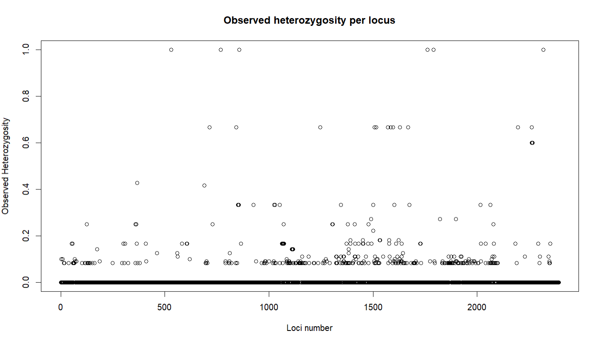
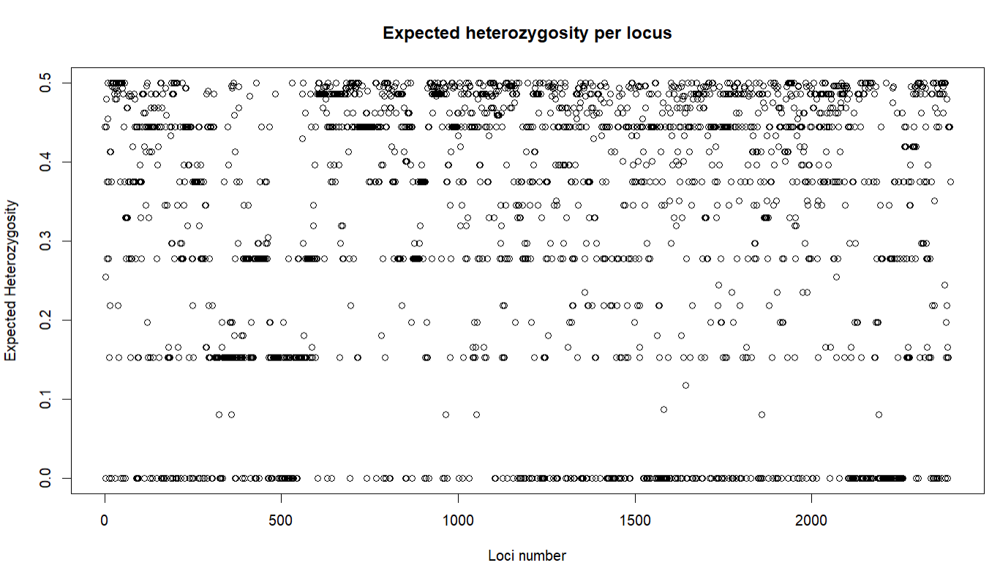
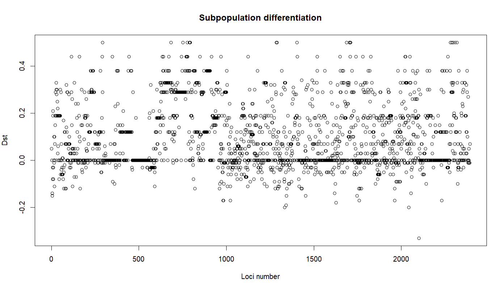
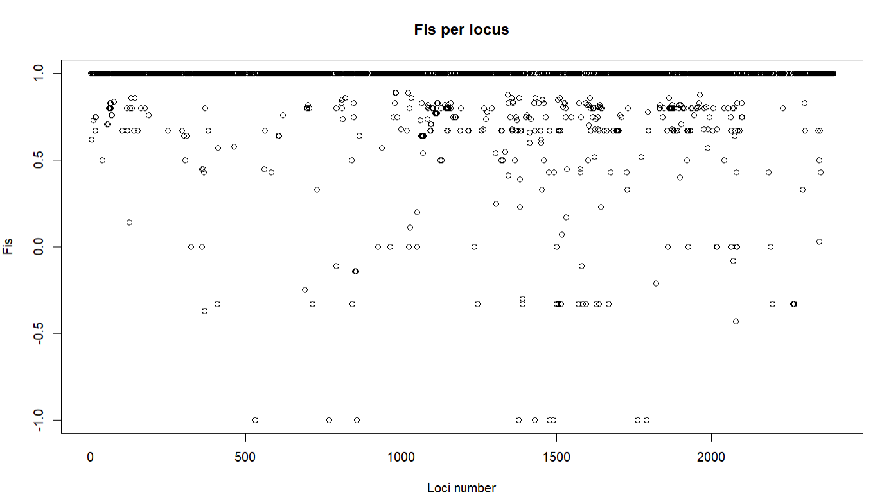
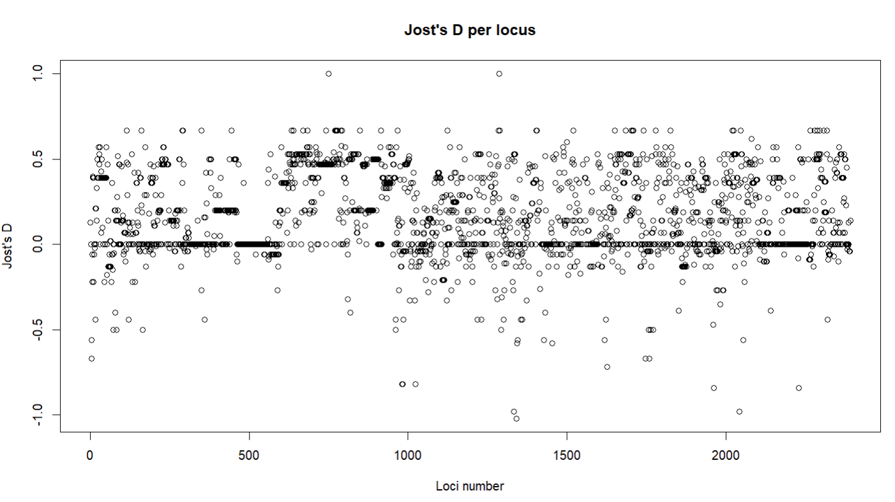

# UNDERSTANDING PRACTICAL 2

## What do the plots mean?

#### Note: Blue and Black plots are two different methods/packages used to compare
####  how their results differ from each other

### PCA Plots

- Each cluster represents a type (EX, SWE, WOSR, SOSR)
- PCAs show us the genetic diversity between those types????
- I don't understand what the axis shows us though

### Number of alleles per locus

- SNP chips are biallelic mostly, so most of loci have 2 alleles

### Observed heterozygosity per locus

- Each point is a SNP marker
- Y-axis = number of heterozygous individuals at that locus
- Here it's 0 which makes sense according to KASP analysis, they are all
  homozygous

### Expected heterozygosity per locus

- Why is He so high when Ho was so low? Well, because we have sub-populations that
  each have different allele frequencies
- And He is calculated using allele frequencies
- We learned in class Ho < He = inbreeding, which is the case here

### Subpopulation differentiation

- How different are allele frequencies in total vs. within groups?
- Bigger DST → larger allele-frequency differences between groups
- DST = HT - HS
- (HT=total diversity; HS=within-population diversity)

### Fst per locus

- How much of genetic variation is due to types having different allele frequencies?
- FST = DST/ Total variation

### Fis per locus

- FIS = (He - Ho)/He
- How much heterozygosity is missing compared to what you would expect
- Here Fis = 1 -> Less heterozygosity than expected
- Many Assyst lines are homozygous and inbred

### Jost's D per locus

- True allelic differentiation
- Independent of heterozygosity

## KASP Analysis

- Method with which you can detect SNPs
- 2 allele-specific primers are used (Like A vs.C)
- Each has a specific fluorescent pigment 
- PCR -> Alleles are amplified if the primer fits
- Result: AA, CC, AC

| Genotype   | Type | Allele |
|------------|------|--------|
| ASSYST-078 | WOSR | AA     |
| ASSYST-120 | WOSR | X      |
| ASSYST-145 | WOSR | AA     |
| ASSYST-210 | EX   | AA     |
| ASSYST-211 | EX   | X      |
| ASSYST-219 | EX   | X      |
| ASSYST-271 | SOSR | AA     |
| ASSYST-273 | SOSR | AA     |
| ASSYST-290 | SOSR | AA     |
| ASSYST-419 | SWE  | X      |
| ASSYST-424 | SWE  | CC     |
| ASSYST-427 | SWE  | X      |

